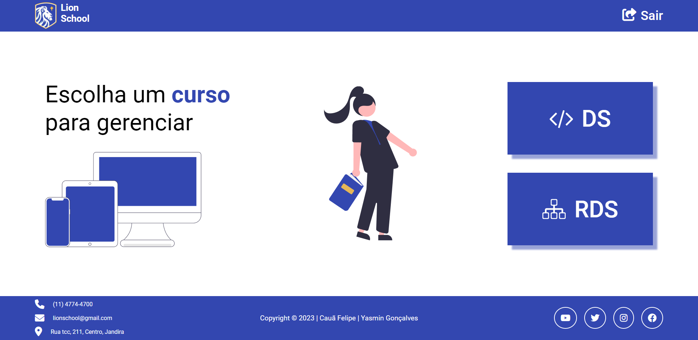

# Atividade integrada - SENAI 2023

[Clique aqui para ver o site.](https://lionschools.vercel.app/)

[Back End](https://github.com/yasmingcv/lion-school)

---

## Objetivo
A atividade tem como objetivo integrar as disciplinas de PWFE (Programação web Front-end) e PWBE (Programação web Back-end) do curso de desenvolvimento de sistemas do [SENAI Jandira](https://jandira.sp.senai.br/).

O projeto é o gerenciamento da escola Lion School, deverá ser realizado tanto o back-end como o front-end. 

---
## Projeto Front-end
Deverá consumir a API e criar as páginas conforme o designer feito no [figma](https://www.figma.com/file/KhTQbG1DY0MdAIGK73ZWp8/PWFE---Trabalho-Integrado?node-id=0%3A1).

### Critérios 
- [ X ] Criou layout conforme designer feito no Figma?
- [ X ] Os botões dos cursos são dinâmicos?
- [ X ] Os cards são criados dinamicamente?
- [ X ] A página com informações dos cursos foi criada dinamicamente?
- [ X ] O filtro por status está funcional?
- [ X ] Os nomes das variáveis, funções e arquivos tem valor semântico?
- [ X ] A maioria das funções seguem as boas práticas como responsabilidade única?
- [ X ] Foi criado o layout responsivo no Figma?
- [ X ] Foi implementado a responsividade conforme planejado no Figma?
- [ X ] Foi criado o filtro por ano?

---
## Projeto Back-end
Deverá criar um servidor API implementando somente o EndPoint na API, contendo os seguintes end-points:

Método | End-point | Descrição 
---|---|---
**GET** | /v1/lion-school/cursos |  Recupera uma lista de todos os cursos oferecidos pela escola.
**GET** | /v1/lion-school/alunos |  Recupera uma lista de todos os alunos matriculados na escola.
**GET** | /v1/lion-school/alunos/{matricula} | Recupera informações de um aluno específico com base no número de matrícula.
**GET** | /v1/lion-school/alunos?curso={ds}: | Recupera uma lista de todos os alunos matriculados no curso especificado.
**GET** | /v1/lion-school/alunos?status={finalizado} | Recupera uma lista de todos os alunos com o status especificado.

---

## Entregas
- [ ] Cronograma de atividades
- [ ] Documentação da API
- [ ] Postman 

---

## Desafio extra
- Além do GitHub Pages, pesquise e implemente outras opções gratuitas para hospedar o front-end.
- Implemente o back-end na plataforma da Microsoft Azure e pesquisa outras opções gratuitas.

### Professores
- [Fernando Leonid](https://github.com/fernandoleonid)
- [Marcel Teixeira](https://github.com/marcelnt)

### Autores
- [Yasmin Gonçalves](https://github.com/yasmingcv)
- [Cauã Felipe](https://github.com/alemao148)
